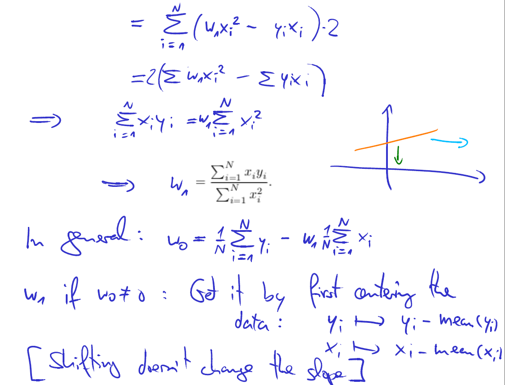
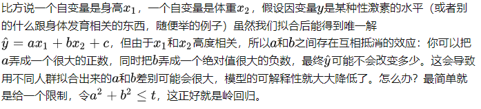

# machine-learning-voelseung6-回归
[toc]

#### a.机器学习是干啥的
你或许每天都在不知不觉中使用了机器学习的算法每次，你打开谷歌、必应搜索到你需要的内容，正是因为他们有良好的学习算法。谷歌和微软实现了学习算法来排行网页每次，你用Facebook或苹果的图片分类程序他能认出你朋友的照片，这也是机器学习。每次您阅读您的电子邮件垃圾邮件筛选器，可以帮你过滤大量的垃圾邮件这也是一种学习算法。对我来说，我感到激动的原因之一是有一天做出一个和人类一样聪明的机器。实现这个想法任重而道远，许多AI研究者认为，实现这个目标最好的方法是通过让机器试着模仿人的大脑学习我会在这门课中介绍一点这方面的内容

#### b.监督学习
主要的两种类型被我们称之为监督学习和无监督学习。
在这里简单说两句，监督学习这个想法是指，我们将教计算机如何去完成任务，而在无监督学习中，我们打算让它自己进行学习。

## 列子
假如说你想预测房价。
前阵子，一个学生从波特兰俄勒冈州的研究所收集了一些房价的数据。你把这些数据画出来，看起来是这个样子：横轴表示房子的面积，单位是平方英尺，纵轴表示房价，单位是千美元。那基于这组数据，假如你有一个朋友，他有一套750平方英尺房子，现在他希望把房子卖掉，他想知道这房子能卖多少钱。
那么关于这个问题，机器学习算法将会怎么帮助你呢？

 我们应用学习算法，可以在这组数据中画一条直线，或者换句话说，拟合一条直线，根据这条线我们可以推测出，这套房子可能卖，当然这不是唯一的算法。可能还有更好的，比如我们不用直线拟合这些数据，用二次方程去拟合可能效果会更好。根据二次方程的曲线，我们可以从这个点推测出，这套房子能卖接近。稍后我们将讨论如何选择学习算法，如何决定用直线还是二次方程来拟合。两个方案中有一个能让你朋友的房子出售得更合理。以上就是监督学习的例子。

可以看出，监督学习指的就是我们给学习算法一个数据集。这个数据集由“正确答案”组成。在房价的例子中，我们给了一系列房子的数据，我们给定数据集中每个样本的正确价格，即它们实际的售价然后运用学习算法，算出更多的正确答案。比如你朋友那个新房子的价格。用术语来讲，这叫做回归问题。我们试着推测出一个连续值的结果，即房子的价格。

# 题
现在来个小测验：假设你经营着一家公司，你想开发学习算法来处理这两个问题：
1.你有一大批同样的货物，想象一下，你有上千件一模一样的货物等待出售，这时你想预测接下来的三个月能卖多少件？
2.你有许多客户，这时你想写一个软件来检验每一个用户的账户。对于每一个账户，你要判断它们是否曾经被盗过？
那这两个问题，它们属于分类问题、还是回归问题?
问题一是一个回归问题，因为你知道，如果我有数千件货物，我会把它看成一个实数，一个连续的值。因此卖出的物品数，也是一个连续的值。
问题二是一个分类问题，因为我会把预测的值，用 0 来表示账户未被盗，用 1 表示账户曾经被盗过。所以我们根据账号是否被盗过，把它们定为0 或 1，然后用算法推测一个账号是 0 还是 1，因为只有少数的离散值，所以我把它归为分类问题。

# 回归问题

面对一个回归问题，我们可简要描述其求解流程：

1. 选定训练模型，即我们为程序选定一个求解框架，如线性回归模型(Linear Regression)等。（那个函数f...）
2. 导入训练集 train_set，即给模型提供大量可供学习参考的正确数据。上面的x和yz都在里面
3. 选择合适的学习算法，通过训练集中大量输入输出结果让程序不断优化输入数据与输出数据间的关联性，从而提升模型的预测准确度。（那个算子）
4. 在训练结束后即可让模型预测结果，我们为程序提供一组新的输入数据，模型根据训练集的学习成果来预测这组输入对应的输出值。
## 1.单变量线性回归(Linear Regression with One Variable)

### a.线性回归算法
线性回归就是要找一条直线，并且让这条直线尽可能地拟合图中的数据点

### 损失函数

现在我们知道了损失函数是衡量回归模型误差的函数，也就是我们要的“直线”的评价标准。这个函数的值越小，说明直线越能拟合我们的数据

### 最小二乘法

### python

## 多元线性回归

##  迈向非线性函数的线性回归
### 多项式回归

## 岭回归
岭回归(英文名：ridge regression, Tikhonov regularization)是一种专用于共线性数据分析的有偏估计回归方法，实质上是一种改良的最小二乘估计法，通过放弃最小二乘法的无偏性，以损失部分信息、降低精度为代价获得回归系数更为符合实际、更可靠的回归方法，对病态数据的拟合要强于最小二乘法。
## 补充 最小二乘法

## 贝叶斯线性回归

