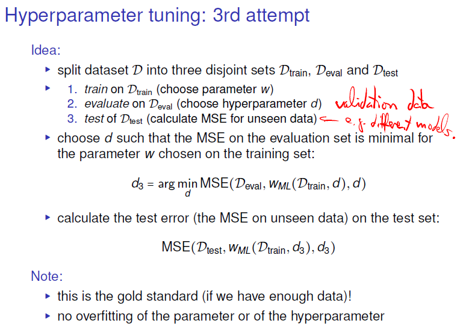
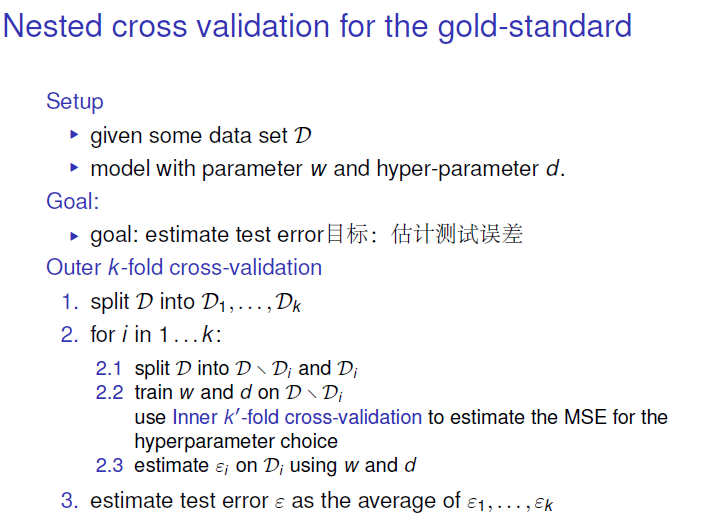

# machine-learning-vorlseung7-超参数调整
[toc]
超参数优化也称作超参数调整。往往机器学习/深度学习的算法中包含了成千上百万的参数，
这些参数有的可以通过训练来优化，例如神经网络中的权重（Weight）等，我们称为参数（Parameter），
也有一部分参数不能通过训练来优化，例如学习率（Learning rate）等，我们称为超参数（Hyperparameter）

参数：就是模型可以根据数据可以自动学习出的变量，应该就是参数。比如，深度学习的权重，偏差等

超参数：就是用来确定模型的一些参数，超参数不同，模型是不同的(这个模型不同的意思就是有微小的区别，比如假设都是CNN模型，如果层数不同，模型不一样，虽然都是CNN模型哈。)，超参数一般就是根据经验确定的变量。

## 第一种 找到最小的MSE

### python

## 第二种 把数据区分成训练集和测试集

弊端 1.最终模型与参数的选取将极大程度依赖于你对训练集和测试集的划分方法
2.该方法只用了部分数据进行模型的训练

## 第三种 分成三部分 

在机器学习里，通常来说我们不能将全部用于数据训练模型，否则我们将没有数据集对该模型进行验证，从而评估我们的模型的预测效果。为了解决这一问题，有如下常用的方法

### 交叉验证

### 嵌套交叉验证（Nested cross-validation）

